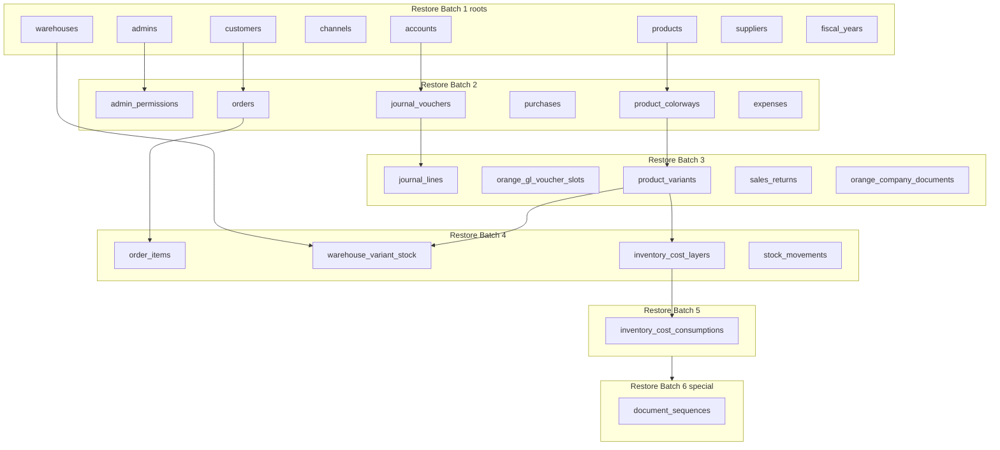

# Country Dependency Graph & Restore Order (Phase C2)

**Status:** ARCHITECTURE ONLY — no implementation, no restore engine, no code  
**Date:** 2026-07-19  
**Boundary SoT:** `docs/backup/COUNTRY_RESTORE_BOUNDARY_POLICY.md` (frozen C1.1)  
**Classification SoT:** `docs/backup/COUNTRY_BOUNDARY_VALIDATION.md` § Corrected classification (D1)  
**Historical only:** `docs/backup/COUNTRY_RESTORE_ARCHITECTURE.md` (C0 — not used for class)  
**Schema truth:** `scripts/orange_db.sql` (87 FK constraints)  
**Registry (hints only; schema wins on column names):** `config/backup_table_registry.json` v1.0 / rev **121**

**Country Restore boundary policy is frozen for dependency-graph design, but Country Restore is not yet certified or enabled.**

---

## 1. Scope and method

| Set | Count | Rule |
|-----|------:|------|
| Country Scoped | 49 | All in mutate graph |
| Mixed replace/special | 31 | In mutate graph (`document_sequences` = special) |
| **Mutate total** | **80** | Topological restore/delete order |
| `journal_entries` | 1 | Mixed **ignore** — excluded (D6) |
| Global | 36 | Excluded |

### Graph health

| Check | Result |
|-------|--------|
| Cycles in country-graph | **None** |
| Same-batch FK violations | **None** |
| Self-FK | `accounts.parent_id` → `accounts` (intra-table) |

---

## 2. Composite restore groups

| Unit | Members | Spans batches |
|------|---------|---------------|
| **A_admin_authz** | `admins`, `admin_permissions` | 1→2 |
| **B_gl_accounting** | accounts/FY/types/dimensions/settings/vouchers/lines/slots/party/pending/bank recon/invoice lines | 1→3 |
| **C_stock_fifo** | warehouses, stock, FIFO layers/consumptions, opening/adjustment/recon vouchers | 1→5 |
| **D_company_docs** | `orange_company_documents` (+ owners in E) | 3 |
| **E_orders_commercial** | customers, storefront, suppliers, purchases/returns, orders/items, sales returns, payments, loyalty | 1→4 |
| **F_catalog_sku** | products + SKU children, channels | 1→3 |
| **G_expenses** | `expenses` after accounts | 2 |
| **H_sequences_special** | `document_sequences` | **6** |

---

## 3. Special handlers

| Handler | Tables | Placement |
|---------|--------|-----------|
| `admins_permissions_composite` | admins, admin_permissions | Batch 1 then 2 |
| `expenses_via_accounts` | expenses | After accounts |
| `polymorphic_company_documents` | orange_company_documents | After owners |
| `gl_voucher_slots_country` | orange_gl_voucher_slots | After journal_vouchers |
| `seq_country_namespace` | document_sequences | **Batch 6 last** |
| `full_only_journal_entries` | journal_entries | **Excluded** |
| `ignore_screen_copy_log` | orange_country_screen_copy_log | **Excluded** |

---

## 4. Restore batches (topological)

### Restore Batch 1

| # | table | class | ownership | composite | notes |
|---|-------|-------|-----------|-----------|-------|
| 1 | `accounts` | Country Scoped | `direct_country_id` | B_gl_accounting | — |
| 2 | `admins` | Country Scoped | `direct_country_id` | A_admin_authz | — |
| 3 | `analytical_dimension` | Country Scoped | `direct_country_id` | B_gl_accounting | — |
| 4 | `cart_bogo_promotions` | Country Scoped | `direct_country_id` | — | — |
| 5 | `cart_combo_promotions` | Country Scoped | `direct_country_id` | — | — |
| 6 | `cart_gift_promotions` | Country Scoped | `direct_country_id` | — | — |
| 7 | `cart_promotions` | Country Scoped | `direct_country_id` | — | — |
| 8 | `channels` | Country Scoped | `direct_country_id` | F_catalog_sku | — |
| 9 | `company_bank_accounts` | Country Scoped | `direct_country_id` | B_gl_accounting | — |
| 10 | `company_settings` | Country Scoped | `direct_country_id` | — | — |
| 11 | `customers` | Country Scoped | `direct_country_id` | E_orders_commercial | — |
| 12 | `delivery_agents` | Country Scoped | `direct_country_id` | — | — |
| 13 | `delivery_areas` | Country Scoped | `direct_country_id` | — | — |
| 14 | `delivery_fee_promotions` | Country Scoped | `direct_country_id` | — | — |
| 15 | `delivery_governorates` | Country Scoped | `direct_country_id` | — | — |
| 16 | `department_countries` | Country Scoped | `direct_country_id` | — | — |
| 17 | `document_public_tokens` | Country Scoped | `direct_country_id` | E_orders_commercial | — |
| 18 | `fiscal_years` | Country Scoped | `direct_country_id` | B_gl_accounting | — |
| 19 | `journal_types` | Country Scoped | `direct_country_id` | B_gl_accounting | — |
| 20 | `loyalty_ledger` | Country Scoped | `direct_country_id` | E_orders_commercial | — |
| 21 | `loyalty_settings` | Country Scoped | `direct_country_id` | E_orders_commercial | — |
| 22 | `opening_stock_voucher` | Country Scoped | `direct_country_id` | C_stock_fifo | — |
| 23 | `orange_edit_lock_registry` | Country Scoped | `direct_country_id` | — | — |
| 24 | `orange_gl_setting_alloc` | Country Scoped | `direct_country_id` | B_gl_accounting | — |
| 25 | `payment_methods` | Country Scoped | `direct_country_id` | E_orders_commercial | — |
| 26 | `payment_transactions` | Country Scoped | `direct_country_id` | E_orders_commercial | — |
| 27 | `products` | Country Scoped | `direct_country_id` | F_catalog_sku | ext: product_types.product_type_id, size_families.size_family_id |
| 28 | `promo_pause_log` | Country Scoped | `direct_country_id` | — | — |
| 29 | `promotion_always_on_history` | Country Scoped | `direct_country_id` | — | — |
| 30 | `stock_adjustment_voucher` | Country Scoped | `direct_country_id` | C_stock_fifo | — |
| 31 | `storefront_accounts` | Country Scoped | `direct_country_id` | E_orders_commercial | — |
| 32 | `storefront_copy_lines` | Country Scoped | `direct_country_id` | — | — |
| 33 | `storefront_phone_merge_requests` | Country Scoped | `direct_country_id` | E_orders_commercial | — |
| 34 | `storefront_promo_messages` | Country Scoped | `direct_country_id` | — | — |
| 35 | `suppliers` | Country Scoped | `direct_country_id` | E_orders_commercial | — |
| 36 | `warehouses` | Country Scoped | `direct_country_id` | C_stock_fifo | — |

**Parallel group P1:** 36 tables — concurrent after Batches 1..0 complete.

### Restore Batch 2

| # | table | class | ownership | composite | notes |
|---|-------|-------|-----------|-----------|-------|
| 1 | `admin_permissions` | Mixed | `admin_ownership` | A_admin_authz | — |
| 2 | `analytical_dimension_value` | Mixed | `parent_fk` | B_gl_accounting | — |
| 3 | `bank_reconciliation` | Country Scoped | `direct_country_id` | B_gl_accounting | — |
| 4 | `customer_addresses` | Mixed | `parent_fk` | E_orders_commercial | — |
| 5 | `delivery_fee_promotion_areas` | Mixed | `parent_fk` | — | — |
| 6 | `delivery_fee_promotion_governorates` | Mixed | `parent_fk` | — | — |
| 7 | `expenses` | Mixed | `account_ownership` | G_expenses | — |
| 8 | `inventory_reconciliation` | Country Scoped | `direct_country_id` | C_stock_fifo | — |
| 9 | `journal_vouchers` | Country Scoped | `direct_country_id` | B_gl_accounting | — |
| 10 | `offers` | Mixed | `parent_fk` | F_catalog_sku | — |
| 11 | `opening_stock_voucher_line` | Mixed | `parent_fk` | C_stock_fifo | — |
| 12 | `orange_gl_account_settings` | Country Scoped | `direct_country_id` | B_gl_accounting | — |
| 13 | `orange_gl_journal_type_rules` | Country Scoped | `direct_country_id` | B_gl_accounting | — |
| 14 | `orange_invoice_line_presets` | Country Scoped | `direct_country_id` | B_gl_accounting | — |
| 15 | `orders` | Country Scoped | `direct_country_id` | E_orders_commercial | — |
| 16 | `product_attribute_values` | Mixed | `parent_fk` | F_catalog_sku | ext: catalog_attributes.catalog_attribute_id |
| 17 | `product_channels` | Mixed | `parent_fk` | F_catalog_sku | — |
| 18 | `product_colorways` | Mixed | `parent_fk` | F_catalog_sku | ext: color_dictionary.primary_color_id, color_dictionary.secondary_color_id |
| 19 | `product_images` | Mixed | `parent_fk` | F_catalog_sku | — |
| 20 | `purchases` | Country Scoped | `direct_country_id` | E_orders_commercial | — |
| 21 | `stock_adjustment_voucher_gl` | Mixed | `parent_fk` | C_stock_fifo | — |
| 22 | `stock_adjustment_voucher_line` | Mixed | `parent_fk` | C_stock_fifo | — |

**Parallel group P2:** 22 tables — concurrent after Batches 1..1 complete.

### Restore Batch 3

| # | table | class | ownership | composite | notes |
|---|-------|-------|-----------|-----------|-------|
| 1 | `bank_reconciliation_line` | Mixed | `parent_fk` | B_gl_accounting | — |
| 2 | `inventory_reconciliation_line` | Mixed | `parent_fk` | C_stock_fifo | — |
| 3 | `journal_lines` | Mixed | `parent_fk` | B_gl_accounting | — |
| 4 | `orange_company_documents` | Mixed | `polymorphic_owner_validation` | D_company_docs | — |
| 5 | `orange_gl_pending_movements` | Mixed | `parent_fk` | B_gl_accounting | — |
| 6 | `orange_gl_voucher_slots` | Country Scoped | `direct_country_id` | B_gl_accounting | — |
| 7 | `orange_invoice_extra_lines` | Country Scoped | `direct_country_id` | B_gl_accounting | — |
| 8 | `party_subledger` | Mixed | `parent_fk` | B_gl_accounting | — |
| 9 | `party_subledger_allocations` | Mixed | `parent_fk` | B_gl_accounting | — |
| 10 | `product_colorway_images` | Mixed | `parent_fk` | F_catalog_sku | — |
| 11 | `product_variants` | Mixed | `parent_fk` | F_catalog_sku | ext: size_family_sizes.size_family_size_id |
| 12 | `purchase_returns` | Mixed | `parent_fk` | E_orders_commercial | — |
| 13 | `sales_returns` | Country Scoped | `direct_country_id` | E_orders_commercial | — |

**Parallel group P3:** 13 tables — concurrent after Batches 1..2 complete.

### Restore Batch 4

| # | table | class | ownership | composite | notes |
|---|-------|-------|-----------|-----------|-------|
| 1 | `inventory_cost_layers` | Country Scoped | `direct_country_id` | C_stock_fifo | — |
| 2 | `order_items` | Mixed | `parent_fk` | E_orders_commercial | — |
| 3 | `purchase_items` | Mixed | `parent_fk` | E_orders_commercial | — |
| 4 | `purchase_return_items` | Mixed | `parent_fk` | E_orders_commercial | — |
| 5 | `sales_return_items` | Mixed | `parent_fk` | E_orders_commercial | — |
| 6 | `stock_movements` | Country Scoped | `direct_country_id` | C_stock_fifo | — |
| 7 | `warehouse_variant_stock` | Mixed | `warehouse_ownership` | C_stock_fifo | — |

**Parallel group P4:** 7 tables — concurrent after Batches 1..3 complete.

### Restore Batch 5

| # | table | class | ownership | composite | notes |
|---|-------|-------|-----------|-----------|-------|
| 1 | `inventory_cost_consumptions` | Mixed | `parent_fk` | C_stock_fifo | — |

**Parallel group P5:** 1 tables — concurrent after Batches 1..4 complete.

### Restore Batch 6

| # | table | class | ownership | composite | notes |
|---|-------|-------|-----------|-----------|-------|
| 1 | `document_sequences` | Mixed | `special_namespace` | H_sequences_special | SPECIAL handler |

**Parallel group P6:** 1 tables — concurrent after Batches 1..5 complete.

---

## 5. Delete batches (children first)

| Delete batch | Inverse of restore | Tables |
|--------------|-------------------|--------|
| **D1** | Restore Batch 6 | `document_sequences` |
| **D2** | Restore Batch 5 | `inventory_cost_consumptions` |
| **D3** | Restore Batch 4 | `inventory_cost_layers`, `order_items`, `purchase_items`, `purchase_return_items`, `sales_return_items`, `stock_movements`, `warehouse_variant_stock` |
| **D4** | Restore Batch 3 | `bank_reconciliation_line`, `inventory_reconciliation_line`, `journal_lines`, `orange_company_documents`, `orange_gl_pending_movements`, `orange_gl_voucher_slots`, `orange_invoice_extra_lines`, `party_subledger`, `party_subledger_allocations`, `product_colorway_images`, `product_variants`, `purchase_returns`, `sales_returns` |
| **D5** | Restore Batch 2 | `admin_permissions`, `analytical_dimension_value`, `bank_reconciliation`, `customer_addresses`, `delivery_fee_promotion_areas`, `delivery_fee_promotion_governorates`, `expenses`, `inventory_reconciliation`, `journal_vouchers`, `offers`, `opening_stock_voucher_line`, `orange_gl_account_settings`, `orange_gl_journal_type_rules`, `orange_invoice_line_presets`, `orders`, `product_attribute_values`, `product_channels`, `product_colorways`, `product_images`, `purchases`, `stock_adjustment_voucher_gl`, `stock_adjustment_voucher_line` |
| **D6** | Restore Batch 1 | `accounts`, `admins`, `analytical_dimension`, `cart_bogo_promotions`, `cart_combo_promotions`, `cart_gift_promotions`, `cart_promotions`, `channels`, `company_bank_accounts`, `company_settings`, `customers`, `delivery_agents`, `delivery_areas`, `delivery_fee_promotions`, `delivery_governorates`, `department_countries`, `document_public_tokens`, `fiscal_years`, `journal_types`, `loyalty_ledger`, `loyalty_settings`, `opening_stock_voucher`, `orange_edit_lock_registry`, `orange_gl_setting_alloc`, `payment_methods`, `payment_transactions`, `products`, `promo_pause_log`, `promotion_always_on_history`, `stock_adjustment_voucher`, `storefront_accounts`, `storefront_copy_lines`, `storefront_phone_merge_requests`, `storefront_promo_messages`, `suppliers`, `warehouses` |

**Forbidden:** delete parent while children remain; delete Global/ignored; delete NULL `country_id` (D2).

---

## 6. Rollback batches

| Mode | Order |
|------|-------|
| **Primary (policy)** | Full pre-restore backup anchor |
| **Country tear-down** | Delete batches D1 → D6 |
| **Country re-apply** | Restore batches 1 → 6 |
| **Sequences** | Special handler only; never lower counters |

---

## 7. Parallel execution groups

| Group | Gate | Count |
|-------|------|------:|
| **P1** | After restore batches less than 1 | 36 |
| **P2** | After restore batches less than 2 | 22 |
| **P3** | After restore batches less than 3 | 13 |
| **P4** | After restore batches less than 4 | 7 |
| **P5** | After restore batches less than 5 | 1 |
| **P6** | After restore batches less than 6 | 1 |

Full member lists = Restore Batch sections above. **No cross-batch parallelism.**

---

## 8. Cycle report

| Finding | Detail |
|---------|--------|
| Directed cycles | **None** |
| Kahn residual | **0** |
| Self-reference | `accounts.parent_id` — intra-table only |

---

## 9. Cross-country / external / impossible

### External Global parents

| child | parent |
|-------|--------|
| `products` | `product_types`, `size_families` |
| `product_variants` | `size_family_sizes` |
| `product_colorways` | `color_dictionary` |
| `product_attribute_values` | `catalog_attributes` |

### Impossible Country paths

| Path | Why |
|------|-----|
| Mutate `journal_entries` | D6 Full-only |
| Mutate `orange_country_screen_copy_log` | D5 |
| NULL as target country | D2 |
| Full replace `document_sequences` | D3 |
| Silent admin id remap | D4 |

---

## 10. Forbidden restore order

1. Child before parent (country-graph edge).
2. `admin_permissions` before `admins`.
3. Voucher children before `journal_vouchers`.
4. `journal_vouchers` before `accounts` / `fiscal_years`.
5. SKU/stock/FIFO before required catalog/warehouse parents.
6. `inventory_cost_consumptions` before `inventory_cost_layers`.
7. `orange_company_documents` before validated owners.
8. `document_sequences` before Batches 1–5.
9. Any Global / `journal_entries` / copy-log in Country order.
10. Parallel restore of tables sharing a country-graph edge.

---

## 11. Per-table dependency matrix (mutate set)

| table | class | parents | children | ownership | composite | restore | delete | tear-down | parallel | forbidden before |
|-------|-------|---------|----------|-----------|-----------|--------:|-------:|-----------|----------|------------------|
| `accounts` | Country Scoped | — | `bank_reconciliation`, `expenses`, `journal_lines`, `orange_gl_account_settings`, `orange_gl_pending_movements`, `orange_invoice_extra_lines`, `orange_invoice_line_presets` | `direct_country_id` | B_gl_accounting | **1** | **6** | D6 | P1 | — |
| `admin_permissions` | Mixed | `admins` | — | `admin_ownership` | A_admin_authz | **2** | **5** | D5 | P2 | `admins` |
| `admins` | Country Scoped | — | `admin_permissions`, `orange_company_documents` | `direct_country_id` | A_admin_authz | **1** | **6** | D6 | P1 | — |
| `analytical_dimension` | Country Scoped | — | `analytical_dimension_value` | `direct_country_id` | B_gl_accounting | **1** | **6** | D6 | P1 | — |
| `analytical_dimension_value` | Mixed | `analytical_dimension` | `journal_lines` | `parent_fk` | B_gl_accounting | **2** | **5** | D5 | P2 | `analytical_dimension` |
| `bank_reconciliation` | Country Scoped | `accounts` | `bank_reconciliation_line` | `direct_country_id` | B_gl_accounting | **2** | **5** | D5 | P2 | `accounts` |
| `bank_reconciliation_line` | Mixed | `bank_reconciliation` | — | `parent_fk` | B_gl_accounting | **3** | **4** | D4 | P3 | `bank_reconciliation` |
| `cart_bogo_promotions` | Country Scoped | — | — | `direct_country_id` | — | **1** | **6** | D6 | P1 | — |
| `cart_combo_promotions` | Country Scoped | — | — | `direct_country_id` | — | **1** | **6** | D6 | P1 | — |
| `cart_gift_promotions` | Country Scoped | — | — | `direct_country_id` | — | **1** | **6** | D6 | P1 | — |
| `cart_promotions` | Country Scoped | — | — | `direct_country_id` | — | **1** | **6** | D6 | P1 | — |
| `channels` | Country Scoped | — | `orders`, `product_channels`, `sales_returns` | `direct_country_id` | F_catalog_sku | **1** | **6** | D6 | P1 | — |
| `company_bank_accounts` | Country Scoped | — | — | `direct_country_id` | B_gl_accounting | **1** | **6** | D6 | P1 | — |
| `company_settings` | Country Scoped | — | — | `direct_country_id` | — | **1** | **6** | D6 | P1 | — |
| `customer_addresses` | Mixed | `customers` | — | `parent_fk` | E_orders_commercial | **2** | **5** | D5 | P2 | `customers` |
| `customers` | Country Scoped | — | `customer_addresses`, `orange_company_documents`, `orders`, `sales_returns` | `direct_country_id` | E_orders_commercial | **1** | **6** | D6 | P1 | — |
| `delivery_agents` | Country Scoped | — | — | `direct_country_id` | — | **1** | **6** | D6 | P1 | — |
| `delivery_areas` | Country Scoped | — | — | `direct_country_id` | — | **1** | **6** | D6 | P1 | — |
| `delivery_fee_promotion_areas` | Mixed | `delivery_fee_promotions` | — | `parent_fk` | — | **2** | **5** | D5 | P2 | `delivery_fee_promotions` |
| `delivery_fee_promotion_governorates` | Mixed | `delivery_fee_promotions` | — | `parent_fk` | — | **2** | **5** | D5 | P2 | `delivery_fee_promotions` |
| `delivery_fee_promotions` | Country Scoped | — | `delivery_fee_promotion_areas`, `delivery_fee_promotion_governorates` | `direct_country_id` | — | **1** | **6** | D6 | P1 | — |
| `delivery_governorates` | Country Scoped | — | — | `direct_country_id` | — | **1** | **6** | D6 | P1 | — |
| `department_countries` | Country Scoped | — | — | `direct_country_id` | — | **1** | **6** | D6 | P1 | — |
| `document_public_tokens` | Country Scoped | — | — | `direct_country_id` | E_orders_commercial | **1** | **6** | D6 | P1 | — |
| `document_sequences` | Mixed | — | — | `special_namespace` | H_sequences_special | **6** | **1** | D1 | P6 | Batches 1-5 must complete |
| `expenses` | Mixed | `accounts` | — | `account_ownership` | G_expenses | **2** | **5** | D5 | P2 | `accounts` |
| `fiscal_years` | Country Scoped | — | `journal_vouchers` | `direct_country_id` | B_gl_accounting | **1** | **6** | D6 | P1 | — |
| `inventory_cost_consumptions` | Mixed | `inventory_cost_layers`, `product_variants`, `warehouses` | — | `parent_fk` | C_stock_fifo | **5** | **2** | D2 | P5 | `inventory_cost_layers`, `product_variants`, `warehouses` |
| `inventory_cost_layers` | Country Scoped | `product_variants`, `warehouses` | `inventory_cost_consumptions` | `direct_country_id` | C_stock_fifo | **4** | **3** | D3 | P4 | `product_variants`, `warehouses` |
| `inventory_reconciliation` | Country Scoped | `warehouses` | `inventory_reconciliation_line` | `direct_country_id` | C_stock_fifo | **2** | **5** | D5 | P2 | `warehouses` |
| `inventory_reconciliation_line` | Mixed | `inventory_reconciliation` | — | `parent_fk` | C_stock_fifo | **3** | **4** | D4 | P3 | `inventory_reconciliation` |
| `journal_lines` | Mixed | `accounts`, `analytical_dimension_value`, `journal_vouchers` | — | `parent_fk` | B_gl_accounting | **3** | **4** | D4 | P3 | `accounts`, `analytical_dimension_value`, `journal_vouchers` |
| `journal_types` | Country Scoped | — | `orange_gl_account_settings`, `orange_gl_journal_type_rules` | `direct_country_id` | B_gl_accounting | **1** | **6** | D6 | P1 | — |
| `journal_vouchers` | Country Scoped | `fiscal_years` | `journal_lines`, `orange_gl_pending_movements`, `orange_gl_voucher_slots`, `party_subledger`, `party_subledger_allocations` | `direct_country_id` | B_gl_accounting | **2** | **5** | D5 | P2 | `fiscal_years` |
| `loyalty_ledger` | Country Scoped | — | — | `direct_country_id` | E_orders_commercial | **1** | **6** | D6 | P1 | — |
| `loyalty_settings` | Country Scoped | — | — | `direct_country_id` | E_orders_commercial | **1** | **6** | D6 | P1 | — |
| `offers` | Mixed | `products` | — | `parent_fk` | F_catalog_sku | **2** | **5** | D5 | P2 | `products` |
| `opening_stock_voucher` | Country Scoped | — | `opening_stock_voucher_line` | `direct_country_id` | C_stock_fifo | **1** | **6** | D6 | P1 | — |
| `opening_stock_voucher_line` | Mixed | `opening_stock_voucher` | — | `parent_fk` | C_stock_fifo | **2** | **5** | D5 | P2 | `opening_stock_voucher` |
| `orange_company_documents` | Mixed | `admins`, `customers`, `orders`, `purchases`, `suppliers` | — | `polymorphic_owner_validation` | D_company_docs | **3** | **4** | D4 | P3 | `admins`, `customers`, `orders`, `purchases`, `suppliers` |
| `orange_edit_lock_registry` | Country Scoped | — | — | `direct_country_id` | — | **1** | **6** | D6 | P1 | — |
| `orange_gl_account_settings` | Country Scoped | `accounts`, `journal_types` | — | `direct_country_id` | B_gl_accounting | **2** | **5** | D5 | P2 | `accounts`, `journal_types` |
| `orange_gl_journal_type_rules` | Country Scoped | `journal_types` | — | `direct_country_id` | B_gl_accounting | **2** | **5** | D5 | P2 | `journal_types` |
| `orange_gl_pending_movements` | Mixed | `accounts`, `journal_vouchers` | — | `parent_fk` | B_gl_accounting | **3** | **4** | D4 | P3 | `accounts`, `journal_vouchers` |
| `orange_gl_setting_alloc` | Country Scoped | — | — | `direct_country_id` | B_gl_accounting | **1** | **6** | D6 | P1 | — |
| `orange_gl_voucher_slots` | Country Scoped | `journal_vouchers` | — | `direct_country_id` | B_gl_accounting | **3** | **4** | D4 | P3 | `journal_vouchers` |
| `orange_invoice_extra_lines` | Country Scoped | `accounts`, `orange_invoice_line_presets` | — | `direct_country_id` | B_gl_accounting | **3** | **4** | D4 | P3 | `accounts`, `orange_invoice_line_presets` |
| `orange_invoice_line_presets` | Country Scoped | `accounts` | `orange_invoice_extra_lines` | `direct_country_id` | B_gl_accounting | **2** | **5** | D5 | P2 | `accounts` |
| `order_items` | Mixed | `orders`, `product_variants`, `products` | — | `parent_fk` | E_orders_commercial | **4** | **3** | D3 | P4 | `orders`, `product_variants`, `products` |
| `orders` | Country Scoped | `channels`, `customers` | `orange_company_documents`, `order_items`, `sales_returns` | `direct_country_id` | E_orders_commercial | **2** | **5** | D5 | P2 | `channels`, `customers` |
| `party_subledger` | Mixed | `journal_vouchers` | — | `parent_fk` | B_gl_accounting | **3** | **4** | D4 | P3 | `journal_vouchers` |
| `party_subledger_allocations` | Mixed | `journal_vouchers` | — | `parent_fk` | B_gl_accounting | **3** | **4** | D4 | P3 | `journal_vouchers` |
| `payment_methods` | Country Scoped | — | — | `direct_country_id` | E_orders_commercial | **1** | **6** | D6 | P1 | — |
| `payment_transactions` | Country Scoped | — | — | `direct_country_id` | E_orders_commercial | **1** | **6** | D6 | P1 | — |
| `product_attribute_values` | Mixed | `products` | — | `parent_fk` | F_catalog_sku | **2** | **5** | D5 | P2 | `products` |
| `product_channels` | Mixed | `channels`, `products` | — | `parent_fk` | F_catalog_sku | **2** | **5** | D5 | P2 | `channels`, `products` |
| `product_colorway_images` | Mixed | `product_colorways` | — | `parent_fk` | F_catalog_sku | **3** | **4** | D4 | P3 | `product_colorways` |
| `product_colorways` | Mixed | `products` | `product_colorway_images`, `product_variants` | `parent_fk` | F_catalog_sku | **2** | **5** | D5 | P2 | `products` |
| `product_images` | Mixed | `products` | — | `parent_fk` | F_catalog_sku | **2** | **5** | D5 | P2 | `products` |
| `product_variants` | Mixed | `product_colorways`, `products` | `inventory_cost_consumptions`, `inventory_cost_layers`, `order_items`, `purchase_items`, `purchase_return_items`, `sales_return_items`, `stock_movements`, `warehouse_variant_stock` | `parent_fk` | F_catalog_sku | **3** | **4** | D4 | P3 | `product_colorways`, `products` |
| `products` | Country Scoped | — | `offers`, `order_items`, `product_attribute_values`, `product_channels`, `product_colorways`, `product_images`, `product_variants`, `purchase_items`, `purchase_return_items`, `sales_return_items`, `stock_movements` | `direct_country_id` | F_catalog_sku | **1** | **6** | D6 | P1 | — |
| `promo_pause_log` | Country Scoped | — | — | `direct_country_id` | — | **1** | **6** | D6 | P1 | — |
| `promotion_always_on_history` | Country Scoped | — | — | `direct_country_id` | — | **1** | **6** | D6 | P1 | — |
| `purchase_items` | Mixed | `product_variants`, `products`, `purchases` | — | `parent_fk` | E_orders_commercial | **4** | **3** | D3 | P4 | `product_variants`, `products`, `purchases` |
| `purchase_return_items` | Mixed | `product_variants`, `products`, `purchase_returns` | — | `parent_fk` | E_orders_commercial | **4** | **3** | D3 | P4 | `product_variants`, `products`, `purchase_returns` |
| `purchase_returns` | Mixed | `purchases`, `suppliers` | `purchase_return_items` | `parent_fk` | E_orders_commercial | **3** | **4** | D4 | P3 | `purchases`, `suppliers` |
| `purchases` | Country Scoped | `suppliers` | `orange_company_documents`, `purchase_items`, `purchase_returns` | `direct_country_id` | E_orders_commercial | **2** | **5** | D5 | P2 | `suppliers` |
| `sales_return_items` | Mixed | `product_variants`, `products`, `sales_returns` | — | `parent_fk` | E_orders_commercial | **4** | **3** | D3 | P4 | `product_variants`, `products`, `sales_returns` |
| `sales_returns` | Country Scoped | `channels`, `customers`, `orders` | `sales_return_items` | `direct_country_id` | E_orders_commercial | **3** | **4** | D4 | P3 | `channels`, `customers`, `orders` |
| `stock_adjustment_voucher` | Country Scoped | — | `stock_adjustment_voucher_gl`, `stock_adjustment_voucher_line` | `direct_country_id` | C_stock_fifo | **1** | **6** | D6 | P1 | — |
| `stock_adjustment_voucher_gl` | Mixed | `stock_adjustment_voucher` | — | `parent_fk` | C_stock_fifo | **2** | **5** | D5 | P2 | `stock_adjustment_voucher` |
| `stock_adjustment_voucher_line` | Mixed | `stock_adjustment_voucher` | — | `parent_fk` | C_stock_fifo | **2** | **5** | D5 | P2 | `stock_adjustment_voucher` |
| `stock_movements` | Country Scoped | `product_variants`, `products`, `warehouses` | — | `direct_country_id` | C_stock_fifo | **4** | **3** | D3 | P4 | `product_variants`, `products`, `warehouses` |
| `storefront_accounts` | Country Scoped | — | — | `direct_country_id` | E_orders_commercial | **1** | **6** | D6 | P1 | — |
| `storefront_copy_lines` | Country Scoped | — | — | `direct_country_id` | — | **1** | **6** | D6 | P1 | — |
| `storefront_phone_merge_requests` | Country Scoped | — | — | `direct_country_id` | E_orders_commercial | **1** | **6** | D6 | P1 | — |
| `storefront_promo_messages` | Country Scoped | — | — | `direct_country_id` | — | **1** | **6** | D6 | P1 | — |
| `suppliers` | Country Scoped | — | `orange_company_documents`, `purchase_returns`, `purchases` | `direct_country_id` | E_orders_commercial | **1** | **6** | D6 | P1 | — |
| `warehouse_variant_stock` | Mixed | `product_variants`, `warehouses` | — | `warehouse_ownership` | C_stock_fifo | **4** | **3** | D3 | P4 | `product_variants`, `warehouses` |
| `warehouses` | Country Scoped | — | `inventory_cost_consumptions`, `inventory_cost_layers`, `inventory_reconciliation`, `stock_movements`, `warehouse_variant_stock` | `direct_country_id` | C_stock_fifo | **1** | **6** | D6 | P1 | — |

### Non-mutate Mixed reference

| table | mode | restore | note |
|-------|------|---------|------|
| `journal_entries` | ignore | ∅ | D6 — would parent to `accounts`/`fiscal_years` if ever touched |

---

## 12. Topological restore order (flat)

1. Batch 1: `accounts`
2. Batch 1: `admins`
3. Batch 1: `analytical_dimension`
4. Batch 1: `cart_bogo_promotions`
5. Batch 1: `cart_combo_promotions`
6. Batch 1: `cart_gift_promotions`
7. Batch 1: `cart_promotions`
8. Batch 1: `channels`
9. Batch 1: `company_bank_accounts`
10. Batch 1: `company_settings`
11. Batch 1: `customers`
12. Batch 1: `delivery_agents`
13. Batch 1: `delivery_areas`
14. Batch 1: `delivery_fee_promotions`
15. Batch 1: `delivery_governorates`
16. Batch 1: `department_countries`
17. Batch 1: `document_public_tokens`
18. Batch 1: `fiscal_years`
19. Batch 1: `journal_types`
20. Batch 1: `loyalty_ledger`
21. Batch 1: `loyalty_settings`
22. Batch 1: `opening_stock_voucher`
23. Batch 1: `orange_edit_lock_registry`
24. Batch 1: `orange_gl_setting_alloc`
25. Batch 1: `payment_methods`
26. Batch 1: `payment_transactions`
27. Batch 1: `products`
28. Batch 1: `promo_pause_log`
29. Batch 1: `promotion_always_on_history`
30. Batch 1: `stock_adjustment_voucher`
31. Batch 1: `storefront_accounts`
32. Batch 1: `storefront_copy_lines`
33. Batch 1: `storefront_phone_merge_requests`
34. Batch 1: `storefront_promo_messages`
35. Batch 1: `suppliers`
36. Batch 1: `warehouses`
37. Batch 2: `admin_permissions`
38. Batch 2: `analytical_dimension_value`
39. Batch 2: `bank_reconciliation`
40. Batch 2: `customer_addresses`
41. Batch 2: `delivery_fee_promotion_areas`
42. Batch 2: `delivery_fee_promotion_governorates`
43. Batch 2: `expenses`
44. Batch 2: `inventory_reconciliation`
45. Batch 2: `journal_vouchers`
46. Batch 2: `offers`
47. Batch 2: `opening_stock_voucher_line`
48. Batch 2: `orange_gl_account_settings`
49. Batch 2: `orange_gl_journal_type_rules`
50. Batch 2: `orange_invoice_line_presets`
51. Batch 2: `orders`
52. Batch 2: `product_attribute_values`
53. Batch 2: `product_channels`
54. Batch 2: `product_colorways`
55. Batch 2: `product_images`
56. Batch 2: `purchases`
57. Batch 2: `stock_adjustment_voucher_gl`
58. Batch 2: `stock_adjustment_voucher_line`
59. Batch 3: `bank_reconciliation_line`
60. Batch 3: `inventory_reconciliation_line`
61. Batch 3: `journal_lines`
62. Batch 3: `orange_company_documents`
63. Batch 3: `orange_gl_pending_movements`
64. Batch 3: `orange_gl_voucher_slots`
65. Batch 3: `orange_invoice_extra_lines`
66. Batch 3: `party_subledger`
67. Batch 3: `party_subledger_allocations`
68. Batch 3: `product_colorway_images`
69. Batch 3: `product_variants`
70. Batch 3: `purchase_returns`
71. Batch 3: `sales_returns`
72. Batch 4: `inventory_cost_layers`
73. Batch 4: `order_items`
74. Batch 4: `purchase_items`
75. Batch 4: `purchase_return_items`
76. Batch 4: `sales_return_items`
77. Batch 4: `stock_movements`
78. Batch 4: `warehouse_variant_stock`
79. Batch 5: `inventory_cost_consumptions`
80. Batch 6: `document_sequences`

---

## 13. Mermaid overview

---

## 14. Precedence

| Doc | Role |
|-----|------|
| Boundary policy | Frozen rules |
| Boundary validation | Frozen classes |
| **This file** | Frozen restore/delete/rollback **batch design** |
| C0 architecture | Historical only |

**No implementation in C2.** Country Restore remains uncertified and disabled.

*End of Phase C2 — Country Dependency Graph & Restore Order.*
